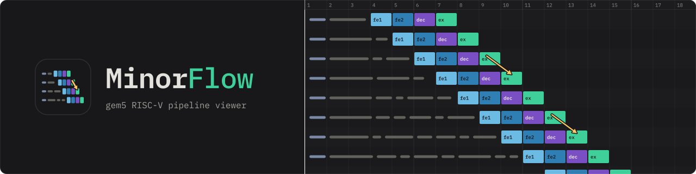

# 

A browser-based pipeline visualiser for gem5's MinorCPU. It reconstructs the pipeline cycle by cycle from a gem5 debug trace and draws every instruction that reached Execute as a row, so you can see exactly where cycles are being lost.


## Motivation

gem5 tells you an instruction took a long time. It does not tell you why. The debug trace holds the answer, but a real workload produces hundreds of megabytes of it, and reading that by hand is not viable.

MinorFlow turns that trace into a picture. Each row is an instruction, each cell is a cycle in a stage, and the colour tells you what the core was doing: waiting on an I-cache fill, stalled behind a functional unit, held by the scoreboard waiting for an operand, or paying for a mispredicted branch.

## Quick start

Capture a trace from gem5:

```bash
gem5.opt --debug-flags=Minor,MinorTrace,CacheAll,ExecAll,Fetch,Decode,RAS \
         --debug-file=trace.txt \
         configs/gem5_config_MinorFlow.py <binary>
```

Or let [`scripts/run_gem5.py`](#running-a-test-scriptsrun_gem5py) compile the test, run it with those flags and report the metrics, all in one command. Run it **from your gem5 root**, giving the path to this repository's copy of the script:

```bash
cd /path/to/gem5
python3 /path/to/MinorFlow/scripts/run_gem5.py configs/gem5_config_MinorFlow.py daxpy.S
```

The current directory has to be the gem5 root, because that is where the script reads `build/`, `include/` and `util/m5/src/abi/riscv/m5op.S`.

Convert the trace to JSON. The driver leaves a copy in `results/run/` under the gem5 root, so from there:

```bash
python3 /path/to/MinorFlow/MinorFlow_tracer.py results/run/daxpy_trace.txt -o daxpy.json
```

Then open `MinorFlow.html` in any browser and drag `daxpy.json` onto the window. There is nothing to install and nothing to serve. The viewer is a single self-contained HTML file with no dependencies.

`RAS` is in that flag list because the return-address-stack markers come from it, and it is off by default in gem5. Without it the JSON is still written, but the RAS push, pop and drop markers are absent and `metadata.degraded` lists `ras`, so `--strict` exits 3. The tracer's closing degraded report says so.

### The sample JSONs

The landing page offers the sample JSONs in `tests/`. Samples are generated, not committed: `scripts/make_MinorFlow_sample.py` trims a full tracer JSON down to one, writing `tests/<source name>.sample.js`, which the page loads, and `tests/<source name>.sample.json` beside it. A sample holds at most the page's `MAX_STREAM_INSTRUCTIONS` records, a limit the script reads from the page. It also keeps `samples.js` beside the sample, a manifest of every sample it wrote there, and warns when that is not the one in `tests/`, since the page loads only `tests/samples.js`. A sample is listed under its output's name without `.sample`, so `tests/daxpy.sample.js` is offered as `daxpy` and named `daxpy (sample)` once loaded.

```bash
python3 scripts/make_MinorFlow_sample.py tests/daxpy.json               # -> tests/daxpy.sample.{json,js}, listed in tests/samples.js
python3 scripts/make_MinorFlow_sample.py tests/daxpy.json -n 1500       # fewer instructions
python3 scripts/make_MinorFlow_sample.py tests/daxpy.json --from 4000   # start past the set-up
```

## Tracer options

```bash
python3 MinorFlow_tracer.py <trace> [-o PATH] [--quiet] [--tpc TICKS] [--strict]
```

| Option                       | Meaning                                                                                                                                                                                                                                                                                                                         |
| ---------------------------- | ------------------------------------------------------------------------------------------------------------------------------------------------------------------------------------------------------------------------------------------------------------------------------------------------------------------------------- |
| `trace`                      | The gem5 MinorCPU debug trace (`.txt`, `.log` or `.trace`)                                                                                                                                                                                                                                                                      |
| `-o`, `--out`                | Where to write the JSON. Defaults to the trace path with its `.txt`, `.log` or `.trace` extension replaced by `.json` and `_trace` dropped from the file name, so `daxpy_trace.txt` writes `daxpy.json`                                                                                                                         |
| `--quiet`                    | Leave out the progress line                                                                                                                                                                                                                                                                                                     |
| `--tpc`, `--ticks-per-cycle` | Ticks per CPU cycle, in place of the detected period, for a trace detection refuses. The start of the trace is still checked, and a period its ticks show to be a multiple or a fraction of the real one is refused. At gem5's default tick rate, 10000 for the 100 MHz Reference Core and 20000 for a 50 MHz core              |
| `--strict`                   | Exit with 3 when `metadata.degraded` is not empty. The JSON is still written. Use it in batch runs so a degraded trace is not mistaken for a complete one. A trace is degraded when a debug-flag line family is missing from the capture, when it was cut part way through a line, or when it holds no instruction or no commit |

The tracer reads the trace twice: pass 1 works out the clock period, pass 2 builds the records. Pass 1 reads only the first 20,000 distinct ticks, takes the commonest gap between them. `--tpc` gives the period instead, for a trace detection refuses, and pass 1 then only checks it. Informational, warning, error and degraded lines go to stderr, and the closing summary to stdout.

`scripts/create_all_MinorFlow_jsons.py` converts every trace in a folder, not recursively, the tracer's folder by default, skipping every trace whose JSON is already at least as new unless `--force` is given. It converts four at a time by default, each tracer with `--quiet` so their progress lines do not interleave, and prints one line as each trace starts and one as it ends. `-j 1` lets the tracer's progress line through. It passes `--strict` to the tracer by default, so a degraded trace makes the batch exit 3 while every JSON is still written, and `--no-strict` turns that off. A conversion that fails outright makes the batch exit 1 instead. `--dry-run` prints which traces would be converted to which JSONs and converts nothing. A trace is a `.txt` whose name holds `_trace.`, and each JSON is named after its trace with `_trace` removed, so `daxpy_trace.config1.txt` becomes `daxpy.config1.json`.

## Running a test: `scripts/run_gem5.py`

Capturing a trace by hand means compiling the test against gem5's `m5op.S`, remembering the full debug-flag list, and then reading the numbers out of `stats.txt`. `scripts/run_gem5.py` does all of it in one command.

Run it **from the gem5 root**: the script takes the current directory as the gem5 root and looks there for the build `--variant` names (`build/RISCV` or `build/RISCV_PATCH`) and its `gem5.opt`, `gem5.fast` or `gem5.debug`, and for `./include` and `./util/m5/src/abi/riscv/m5op.S`. The script itself can live anywhere, and so can the config and the test: both are looked for relative to the gem5 root first and then relative to this repository, so a path that is right in the clone works from the gem5 root too.

```bash
python3 /path/to/MinorFlow/scripts/run_gem5.py <config>.py <test> [--variant stock|patch] [--build NAME] [--suite config|viewer] [--lang auto|c|asm] [--no-trace] [--gem5-out-dir DIR] [--results-dir DIR] [--skip-build-check]
```

| Argument             | Meaning                                                                                                                                                                             |
| -------------------- | ----------------------------------------------------------------------------------------------------------------------------------------------------------------------------------- |
| `<config>.py`        | The gem5 MinorCPU configuration script, for example [configs/gem5_config_MinorFlow.py](configs/gem5_config_MinorFlow.py)                                                            |
| `<test>`             | The test to run: C (`.c`) or assembly (`.S`, `.s`, `.asm`, `.sx`). The type is detected from the extension                                                                          |
| `--lang`             | Force the input type, which selects both the compile flags and the overhead profile. Defaults to `auto`, detection by extension                                                     |
| `--variant`          | `stock` or `patch`: which build to run and whose overhead profile to subtract. Defaults to `stock`                                                                                  |
| `--build`            | Which build to run: a directory name under `build/`, a path to one, or a path to the binary. Defaults to the build `--variant` names, `RISCV` for stock and `RISCV_PATCH` for patch |
| `--skip-build-check` | Run even when the build does not match `--variant`. Without it a mismatch stops the run, since each variant has its own overhead profile                                            |
| `--suite`            | Which overhead table to subtract, `config` or `viewer`. Defaults to the `.overhead_suite` file beside the test or up to two folders above it, and the run stops without one         |
| `--no-trace`         | Do not write the trace, and report metrics only. Use it when you only want the numbers, since the trace is the expensive part                                                       |
| `--gem5-out-dir`     | Where gem5 writes and the test is compiled. Defaults to `results/m5out/`                                                                                                            |
| `--results-dir`      | Where the files worth keeping are copied. Defaults to `results/run/` under the gem5 root                                                                                            |
| anything else        | Passed on to the configuration script. A configuration that defines its own options gets them this way                                                                              |

What it does, in order:

1. **Compiles.** `riscv64-unknown-elf-gcc` for `rv64gc` with the bit-manipulation and crypto extensions, freestanding (`-nostdlib -nostartfiles -static -mcmodel=medany`), linking gem5's `m5op.S` so the program can call `m5_reset_stats`, `m5_dump_stats` and `m5_exit`. C tests also get `-fno-builtin -e main`, since there is no crt0 to enter through.
2. **Runs gem5** into `results/m5out/`, adding the debug flags MinorFlow needs (`Minor`, `MinorTrace`, `CacheAll`, `ExecAll`, `Fetch`, `Decode`, `RAS`) and writing `results/m5out/<test>_trace.txt`. That file is the tracer's input.
3. **Disassembles.** `objdump -d -S -l` into `results/m5out/<test>.list`, then writes the listing up to the `jal` to `m5_dump_stats`, which is where the measured region ends, into `results/m5out/<test>_report.txt`, under a `DISASSEMBLED CODE` banner and closed by an `END OF DISASSEMBLED CODE` one.
4. **Prints the table**, parsed from the first statistics block in `stats.txt`, the one delimited by the `m5_reset_stats` and `m5_dump_stats` calls: cycles, instructions, I-cache and D-cache misses and accesses, branches, mispredictions plus unpredicted, elapsed microseconds and IPC. The table is appended to `results/m5out/<test>_report.txt` below the disassembly, in its own banner, so the two sections can be told apart at a glance. Its title line names the simulator, the program and the L1 geometry the run used, read from gem5's `config.ini`, the line under it names the configuration file and the flags it was given, and a third names the build.
5. **Copies out the keepers.** The trace, the `.list`, the `_report.txt` and `stats.txt` renamed to `<test>_stats.txt` go into a `results/run/` folder under the gem5 root, so a run leaves everything the tracer needs in one place while gem5's own output stays in `results/m5out/`.

If a run fails nothing is deleted, and gem5's whole stdout and stderr are written to `<test>_error.log` in the output folder, with the end of it printed.

The test is compiled into the gem5 output folder rather than beside the source, so a run touches nothing outside its own folders. `--gem5-out-dir` and `--results-dir` move those folders, which is how the sweep gives concurrent runs one each.

The table has an `OFFICIAL` and a `NET` column. `NET` subtracts a fixed instrumentation overhead. A **patched build adds a third, `NET (CVA6)`**.

Which overhead table it subtracts is `--suite`, and `--variant` picks the stock or the patched profile within it. This repository's benchmarks and the CVA6 fork's calibration benchmarks use different test templates, so their scaffolding costs differ, and `scripts/run_gem5.py` is one file carrying both tables. It reads the choice from a one-line `.overhead_suite` file beside the benchmarks, which says `viewer` here and `config` in the fork, prints the choice, and `--suite` overrides it. With no marker the run stops, and says to pass `--suite` or add the file.

A profile is what a suite's empty `test_template` costs on its own. `scripts/measure_gem5_overhead.py` measures every one: it runs each suite's two templates on both builds, the stock one on `gem5_config_CVA6.py` and the patched one on `gem5_config_CVA6_patch.py`, prints the profiles beside the ones `run_gem5.py` carries, and with `--write` puts them into it. `--suite` and `--variant` narrow it, and `-n` prints the runs. Launch it from the gem5 root, where the fork's benchmarks and configurations are.

### What a patched build adds

`MinorCPU_CVA6.patch` puts three mechanisms in the trace that a stock build has no counterpart for, and the viewer draws all of them. The return address stack after them is stock, and only its drop marker needs the patch.

**Store-collision hold.** CVA6 has no store-to-load forwarding, so a load whose address collides with a pending store waits in the load-store queue for the store buffer to drain, then pays a restart penalty before presenting its request again. The two together fill the gap between `lsq_push_cycle` and `lsq_issue_cycle`, which is blank without them, and appear as `st coll` and `replay` strips with their own legend entries.

**Cache holds.** The `D-cache Held` and `I-cache Held` toggles tint every cycle column in which that cache held a request off. Holding is a property of the cache rather than of any one instruction, so each draws as a band across every row, like the stall highlight. A toggle whose JSON carries no spans is disabled and says why, so an empty result cannot be mistaken for a broken control.

There are two forms, and accept-and-charge replaces blocking for **two causes only**: the dirty-victim readout and the refill window. Everything else still blocks under either form, so a single run usually shows both.

**Front-end hold.** With `fetch1WaitsForIcache` the fetch unit keeps its line at the I-cache's ready line instead of sending into a refusal and paying the retry round trip, which is what CVA6 does. That moves the wait ahead of the request, so it is no longer the gap between `Fetch1 req` and `Fetch1 resp` that a stock build shows as `ic stall (retry)`. The cycles are read from the held line itself and drawn before the request cell as `pre-fetch (ic)`, with its own legend entry, _Pre-fetch wait (I-cache)_, so the cost stays visible and lands where it is actually paid. A stock trace has no held lines and keeps its `(retry)` cells.

**Return address stack.** `scripts/run_gem5.py` enables gem5's `RAS` debug flag, which is stock but off by default. Every call that pushes and every return that pops is marked on its Fetch2 cell as `ras+` and `ras-`, when the trace ties the operation to it, in the same strip row as the branch outcome. Where the two fall on one cell, the RAS glyph takes the right third of the outcome marker, so both stay visible. A squash that leaves a speculative push or pop standing, which is what `rasNoRecovery` transcribes on a patched build, is marked `ras!`.

The **Extra Info** panel adds a _Return address stack (current fetch range)_ section with the picture the per-instruction markers cannot give: pushes and pops, the deepest the stack reached, against its capacity when `config_params` holds a `RAS size`, the depth left at the end, and how many operations squashes left unrepaired. A depth well above zero at the end on a balanced program is the signature of that last figure.

A configuration script may define options of its own. Any flag `scripts/run_gem5.py` does not recognise is handed to it, since gem5 passes everything after the script's path to the script:

```bash
python3 /path/to/MinorFlow/scripts/run_gem5.py my_config.py daxpy.S --some-config-flag
python3 /path/to/MinorFlow/scripts/run_gem5.py my_config.py daxpy.S -- --some-config-flag 4   # when it takes a value
```

The `--` form is the unambiguous one: use it for a flag that takes a value, or one whose name collides with one of `scripts/run_gem5.py`'s own options. Forwarded flags are echoed before the run, and if the configuration rejects them its own error comes back through.

### A whole folder at once

`scripts/run_all_gem5_benchmarks.py` runs every benchmark in a folder through `run_gem5.py`, the first of `benchmarks/viewer/`, `benchmarks/config/` and `benchmarks/` that exists when none is given, skips the templates, gathers the results in `results/batch/` in the working directory, and prints a pass and fail summary. That default is the sweep's order, so a container runs the viewer's set and a checkout of this repository its own benchmarks. A failed run is kept rather than cleaned, so its output is still there at the end, and an interrupted one counts as failed with code 130. Run it from the gem5 root, which is where `run_gem5.py` looks for the build. The config and the folder are looked for relative to the gem5 root and then to this repository, the way `run_gem5.py` resolves them.

```bash
python3 /path/to/MinorFlow/scripts/run_all_gem5_benchmarks.py configs/gem5_config_MinorFlow.py benchmarks/
```

### Writing a test

[benchmarks/](benchmarks/) holds the programs written while developing the viewer, and `test_template.c` and `test_template.S` are the starting points. The C template sets up `gp`. Both call `m5_reset_stats`, leave a `MAIN PROGRAM` / `END OF MAIN PROGRAM` region for your code, and call `m5_dump_stats` and `m5_exit`. The statistics cover everything between the two m5 calls, and the viewer's **Main Code** button finds the same region from the harness instructions.

## Running the sweep: `scripts/run_MinorFlow_sweep.py`

[configs/gem5_config_MinorFlow.py](configs/gem5_config_MinorFlow.py) is not one machine but seventeen. Set `TEST` to the one you want. `TEST 1` is the Reference Core, and every other entry perturbs one part of the pipeline so its effect is visible in the viewer, against the workload that shows it:

| #   | What it changes                                                                                                     | Workload        |
| --- | ------------------------------------------------------------------------------------------------------------------- | --------------- |
| 1   | baseline                                                                                                            | all             |
| 2   | `fetch2ToDecodeForwardDelay` 1 to 2                                                                                 | daxpy           |
| 3   | `decodeToExecuteForwardDelay` 1 to 2                                                                                | daxpy           |
| 4   | `fetch1LineWidth` and snap 4 to 16                                                                                  | icache_hit_loop |
| 5   | `fetch1FetchLimit` 1 to 4, L1I 16KiB to 2KiB                                                                        | icache_hit_loop |
| 6   | `fetch2InputBufferSize` 3 to 6                                                                                      | int_loop        |
| 7   | `decodeInputBufferSize` 4 to 8                                                                                      | int_loop        |
| 8   | `executeInputBufferSize` 8 to 3                                                                                     | int_loop        |
| 9   | dual issue, 2-wide                                                                                                  | matrix_mul      |
| 10  | `executeCommitLimit` 2 to 1 on the 2-wide pipe, so commit becomes the binding limit against 9                       | matrix_mul      |
| 11  | `branchPred` LocalBP to TournamentBP                                                                                | branch_stress   |
| 12  | L1D access latency 1 to 3                                                                                           | dcache_hit_loop |
| 13  | `executeLSQStoreBufferSize` 16 to 2                                                                                 | stream_store    |
| 14  | baseline at 47 MHz, clock only                                                                                      | int_loop        |
| 15  | L1I access latency 1 to 3                                                                                           | icache_hit_loop |
| 16  | `executeBranchDelay` 1 to 10                                                                                        | branch_stress   |
| 17  | combination: 2-wide, L1I and L1D latency 3, fetch2-to-decode and decode-to-execute delays 2, branch delay 5, 60 MHz | daxpy           |

`scripts/run_MinorFlow_sweep.py` replays all of it. It sweeps `configs/gem5_config_MinorFlow.py`, the config it is written for, unless `--config` names a copy, so it takes no positional config argument. Run it from the gem5 root, like `scripts/run_gem5.py`:

```bash
python3 /path/to/MinorFlow/scripts/run_MinorFlow_sweep.py [--configs 1,4-6] [--tests-dir DIR] [--tests LIST] [--out-dir DIR] [--config FILE] [--variant stock|patch] [--build NAME] [--suite config|viewer] [--skip-build-check] [--no-trace] [-j N] [--dry-run]
```

| Option               | Meaning                                                                                                                                                                                                                                                           |
| -------------------- | ----------------------------------------------------------------------------------------------------------------------------------------------------------------------------------------------------------------------------------------------------------------- |
| `--configs`          | Which configurations to run, for example `1,4-6`. Defaults to every one in the table                                                                                                                                                                              |
| `--tests-dir`        | Where the workloads live. Defaults to the first of `benchmarks/viewer/`, `benchmarks/config/` and this repository's own flat `benchmarks/` that exists, each resolved the way `scripts/run_gem5.py` resolves a path, the gem5 root first and then this repository |
| `--tests`            | Comma-separated workloads to run for every configuration, instead of the ones the table names                                                                                                                                                                     |
| `--out-dir`          | Where results are collected. Defaults to `results/sweep_MinorFlow/` in the working directory                                                                                                                                                                      |
| `--config`           | Sweep a copy or a variant of `configs/gem5_config_MinorFlow.py` instead                                                                                                                                                                                           |
| `--variant`          | Forwarded to `scripts/run_gem5.py`. Defaults to `stock`, since this is a stock-gem5 sweep                                                                                                                                                                         |
| `--build`            | Forwarded to `scripts/run_gem5.py`: which build to run                                                                                                                                                                                                            |
| `--suite`            | Forwarded to `scripts/run_gem5.py`: which overhead table to subtract. Defaults to the `.overhead_suite` file beside each workload, and `run_gem5.py` stops without one                                                                                            |
| `--skip-build-check` | Forwarded to `scripts/run_gem5.py`: run even when the build does not match `--variant`                                                                                                                                                                            |
| `--no-trace`         | Metrics only, no traces                                                                                                                                                                                                                                           |
| `-j`, `--jobs`       | How many runs to keep in flight. Defaults to 4, or the core count if lower. gem5 is single-threaded, so this scales with cores until memory or disk bandwidth binds                                                                                               |
| `--dry-run`          | Print the plan and exit, touching nothing                                                                                                                                                                                                                         |

For each configuration it sets `TEST` and runs that configuration's workloads through [`scripts/run_gem5.py`](#running-a-test-scriptsrun_gem5py). A configuration whose workload is `all` runs every workload the table names.

Results are moved out of `results/run/` into the out directory as `<test>_trace.config<N>.txt`, `<test>_report.config<N>.txt`, `<test>_stats.config<N>.txt` and `<test>.config<N>.list`, so one configuration never overwrites another and each trace stays paired with the run it came from. `scripts/create_all_MinorFlow_jsons.py` then names each JSON after its trace, `<test>.config<N>.json`. Every metrics table is also gathered into one file in that folder, named after the run that produced it.

Each run works in its own folder under `results/m5out/` and `results/run/`, and once collected that folder is deleted. A run that **fails**, or is interrupted, which counts as a failure with code 130, is the exception: nothing of it is collected or deleted, so its output survives the rest of the sweep, in `results/m5out/config<N>_<test>/` with the configuration copy it ran, and the sweep exits 1. Both parent folders are removed if the sweep leaves them empty, and left alone otherwise, since a plain `scripts/run_gem5.py` run writes into them too.

The sweep never edits `configs/gem5_config_MinorFlow.py`: it writes one temporary copy per configuration with `TEST` set, runs those, and deletes them at the end. So an interrupted sweep leaves nothing to restore, and two sweeps can run at once. Use `--dry-run` first: it prints what each configuration would run, names the closest files for any workload that matches nothing, and calls out configurations left with nothing to run.

## What the viewer shows

Per instruction, across its whole lifetime:

- **Fetch1**, request and response, with the request drawn red when the line misses the I-cache and the fill time charged to the stage that waits for it. Instructions whose bytes span two fetch lines are drawn as two requests, so a line-spanning fetch is visible as such.
- **Fetch2**, where the branch predictor is consulted and correct predictions are marked. Mispredictions and unpredicted branches are marked on the Execute cell, where they are caught.
- **Decode**, and the forward transit of each pipeline latch when the corresponding delay parameter is greater than one.
- **Execute**, including the wait ahead of a functional unit for the unit itself and for operands held by the scoreboard.
- **Commit wait** and **commit**, so in-order retirement pressure is visible.

Bubbles, front-end stalls, serialisation delays and branch delays each get their own colour and their own entry in the legend, with an explanation attached.

When `metadata.degraded` lists a mechanism, a banner under the toolbar names it, every figure it feeds in the metric bar, Extra Info and the tooltip shows `-` instead of a number, by the same rule in MinorFlow and CVA6Flow, and Extra Info lists what each one affects.

The pre-fetch wait counts in Cycles, Time, IPC and every stall figure whatever the Pre-fetch Wait toggle says. The toggle only shows or hides the wait's cell, and no cycle number moves with it.

The viewer also has fit-to-viewport zoom, collapsible panels, a tooltip with per-instruction detail that `P` pins into a dock for side-by-side comparison, and a PC search box that matches anywhere in the address and steps through hits across the current fetch range rather than only the rows on screen. Every control has an in-app tooltip, so they are not repeated here.

Keys: `+` and `-` to zoom, arrows to navigate, `Home` and `End` to jump, `Enter` and `Shift+Enter` to step through PC matches, `P` to pin the tooltip, `Esc` to close panels and clear the pins.

## Tested with

MinorFlow has been tested with **gem5 v25.0.0.1** and its MinorCPU RISC-V model.

If you would rather not build gem5 yourself, a ready-to-use Docker image is available with gem5 already built, so you can produce traces without compiling anything:

```bash
docker pull manuel313/famaf_gem5
```

Image: https://hub.docker.com/r/manuel313/famaf_gem5

## Serving it from a container: `scripts/serve_MinorFlow.py`

A container has no browser. `scripts/serve_MinorFlow.py` serves the page over HTTP, so it opens in the host's browser while the trace stays inside. The page loads from the server only the samples `tests/samples.js` lists, and any other JSON from the host's disk, dropped onto it or chosen with Load JSON:

```bash
python3 scripts/serve_MinorFlow.py              # port 8000, the page's folder
python3 scripts/serve_MinorFlow.py --port 9000
python3 scripts/serve_MinorFlow.py --bind 0.0.0.0
```

It serves the first of the working directory, its own folder and the folder above that holds `MinorFlow.html`, and `--root` names another. Outside a container it listens on `127.0.0.1`, so a run on a laptop does not offer the repository to the network, and inside one on `0.0.0.0`, which a published port needs. `--bind` overrides either.

Served from this repository, the page is at `http://localhost:8000/MinorFlow.html`. The project's image keeps the viewer in `MinorFlow/` under its root and publishes the container's port 8000 on host port 8000, so from the host the page is at `http://localhost:8000/MinorFlow/MinorFlow.html`. The two viewers take different host ports, so both can be served at once.

Inside a container, `scripts/make_MinorFlow_sample.py` turns a JSON made there into a sample in `tests/` beside the page, so the host's browser offers it without the JSON being copied out. `-n 0` keeps every record, up to the 500,000 the page renders at once.

## Requirements

- Python 3, standard library only, for the tracer and the scripts that run gem5
- A RISC-V bare-metal toolchain, for compiling and disassembling a test: `riscv64-unknown-elf-gcc` and `riscv64-unknown-elf-objdump`, which `scripts/run_gem5.py` calls
- autopep8, pycodestyle, pyflakes, Node.js and Prettier, only for the repository checks and the formatter
- Any modern browser
- gem5 with the MinorCPU RISC-V model, for producing traces

## Paper

MinorFlow is described in _MinorFlow: A gem5 Pipeline Visualizer for Teaching Computer Architecture_, by Manuel Nieto, Francisco Cortez Casini, María Delfina Vélez Ibarra and Gonzalo Tomás Vodanovic, submitted to **CARLA 2026**, the Latin America High Performance Computing Conference. It motivates the tool from the gap between the textbook five-stage pipeline and what gem5 actually reports, describes the tracer and the viewer, and validates the timeline against gem5's own `stats.txt` on daxpy.

Everything behind the paper lives in [docs/CARLA2026/](docs/CARLA2026/), frozen at the state it was submitted in:

| Path                                                                           | Contents                                                                                 |
| ------------------------------------------------------------------------------ | ---------------------------------------------------------------------------------------- |
| `MinorFlow: A gem5 Pipeline Visualizer for Teaching Computer Architecture.pdf` | The submitted paper                                                                      |
| `latex/`                                                                       | LaTeX sources, bibliography and LNCS style files                                         |
| `images/`                                                                      | Figures: the pipeline and workflow diagrams, the renderer, and the three case studies    |
| `gem5_config_Reference_Core.py`                                                | The gem5 configuration of the Reference Core the paper measures                          |
| `daxpy_validation/`                                                            | The daxpy kernel, its trace-derived JSON and the `stats.txt` behind the validation table |
| `MinorFlow.html`, `MinorFlow_tracer.py`, `run_gem5.py`                         | The viewer, the tracer and the run driver as submitted                                   |

The Reference Core is the single-issue in-order 64-bit RISC-V MinorCPU of Table 1 in the paper: 100 MHz, a 16 KiB 4-way L1I and a 32 KiB 8-way L1D at one-cycle hit, a 1024-entry local branch predictor with a 256-entry BTB and a 16-entry RAS. [configs/gem5_config_Reference_Core.py](configs/gem5_config_Reference_Core.py) is the working copy, with the same parameters. Run it the same way as any other config:

```bash
gem5.opt --debug-flags=Minor,MinorTrace,CacheAll,ExecAll,Fetch,Decode,RAS \
         --debug-file=trace.txt \
         configs/gem5_config_Reference_Core.py <binary>
```

It is the baseline of the sweep in [configs/gem5_config_MinorFlow.py](configs/gem5_config_MinorFlow.py), flattened into a standalone file: identical parameters, without the test table. Use the sweep instead when you want to perturb one part of the pipeline against this baseline.

If you use MinorFlow in academic work, please cite it. [CITATION.cff](CITATION.cff) carries the metadata for both the software and the paper.

## Related

[CVA6Flow](https://github.com/FaMAF-CVA6-Project/CVA6Flow) is the sibling tool. It visualizes the CORE-V CVA6 RISC-V core running under Verilator, from its Verilator VCDs. The two are deliberately built to look and behave the same way, so that a simulated pipeline and a real RTL pipeline can be put next to each other and compared cycle by cycle.

Both come out of a thesis at FaMAF, Universidad Nacional de Córdoba, asking how closely a gem5 MinorCPU configuration can be made to match a real RISC-V core.

## Cleaning up

`scripts/clean_MinorFlow_repo.py` deletes what a run leaves in this repository: every `.list` disassembly and gem5 debug trace, and every `__pycache__`. It lists what it found with its size and asks before deleting. No JSON or `.js` is touched, and `docs/` is kept whole, since the CARLA 2026 daxpy validation under it is the evidence behind the paper.

```bash
python3 scripts/clean_MinorFlow_repo.py [-y] [--dry-run] [-v]
```

`scripts/clean_gem5_runs.py` is the other one, and clears run output rather than this repository's artefacts: `results/m5out/`, `results/run/`, `results/batch/`, the sweep result folders, `results/parity/` and `results/overhead/`, under the working directory and under this repository, plus every `__pycache__` below them. It lists what it found with its size and asks before deleting. Launch it from the gem5 root.

### Oversized JSONs

A tracer JSON is never deleted, since it is what the viewer reads, but a long run makes one too big to commit: GitHub warns above 50 MiB and refuses above 100 MiB, and git matches a path and never a size. `scripts/ignore_big_MinorFlow_jsons.py` measures the JSONs and the sample `.js` files in this repository, leaving out the frozen `docs/CARLA2026/`, and writes the oversized ones into a block of `.gitignore` that it owns.

```bash
python3 scripts/ignore_big_MinorFlow_jsons.py [-y] [--dry-run] [-v] [-l MIB] [--prune]
```

Without `--prune` it only adds, so a second run changes nothing. `--prune` drops the entries whose file has gone or shrunk below the threshold, and `-l` sets a different threshold in MiB. A file git already tracks is reported rather than ignored.

## Testing the size limits: `scripts/make_MinorFlow_oversized.py`

Past the page's `MAX_JSON_BYTES` the viewer counts a JSON's records and streams the file, and past `MAX_STREAM_INSTRUCTIONS` it offers a range instead. A range, or a sample cut from a larger JSON, can leave out a marker of the main program, so **Main Code** is disabled unless both of its markers are among the loaded records, and its tooltip then names the records that are. `scripts/make_MinorFlow_oversized.py` reads both from `MinorFlow.html` and builds a JSON past both, so those paths can be exercised without waiting for a run large enough to produce one:

```bash
python3 scripts/make_MinorFlow_oversized.py tests/daxpy.json              # a fifth past both page limits
python3 scripts/make_MinorFlow_oversized.py tests/daxpy.json --mib 700    # by size alone
```

It repeats a tracer JSON rather than fabricating records. Without `-n` or `--mib` it goes a fifth past both of the page's limits, `-n` or `--mib` alone replaces that target, and with both, both must be reached. The closing line says which path each crossed limit sends the JSON down. The output, `oversized.json` in the working directory by default, is gitignored, and a write that fails or is interrupted removes its side files.

## Checking the repository: `scripts/check_MinorFlow_repo.py`

Ten checks: every Python file compiles and is clean under pyflakes, every command-line script answers `--help`, the page's JavaScript parses, every shared block matches its other copies and `scripts/shared_blocks.json`, every script named in the text exists, every relative Markdown link resolves, comments carry no semicolon and no non-ASCII character but an accented letter and stay within three lines, nothing gained trailing whitespace, a missing final newline or a new over-long line, and the formatter would change nothing:

```bash
python3 scripts/check_MinorFlow_repo.py
python3 scripts/check_MinorFlow_repo.py --list        # name the checks and stop
python3 scripts/check_MinorFlow_repo.py -k formatting # just one
```

A shared block is code kept identical in several files, between a `SHARED BEGIN <name>` and a `SHARED END <name>` comment. The page, the tracer and the scripts share blocks with CVA6Flow and with the CVA6 fork's `viewers/FlowCompare.html` and checker. The check compares every copy in this repository with the others and with the manifest, with the copies in `CVA6Flow` and `FlowCompare.html` when either sits beside this repository, and with the fork's `scripts/check_CVA6_repo.py` when this repository is the fork's submodule.

## Formatting: `scripts/format_MinorFlow_repo.py`

autopep8 at 79 columns for the Python, Prettier for the Markdown, over this repository's own files only. autopep8 is pinned, Prettier is whatever is installed. The benchmarks get the parent repository's `.editorconfig` rules, no trailing whitespace and a final newline, and the assembly is indented by two spaces with its operands aligned one space past the file's longest mnemonic, comment lines left as they are. No C style is imposed, because none is configured for this tree. `--check` reports without changing anything, and is what the `formatter` check above runs, so a formatted tree stays formatted.

```bash
python3 scripts/format_MinorFlow_repo.py           # format in place
python3 scripts/format_MinorFlow_repo.py --check   # report, change nothing
python3 scripts/format_MinorFlow_repo.py --python  # one language
```

## Licence

Released under the MIT License. The Springer LaTeX class and BibTeX style in `docs/CARLA2026/latex/` keep Springer's own terms. See [LICENSE](LICENSE).
