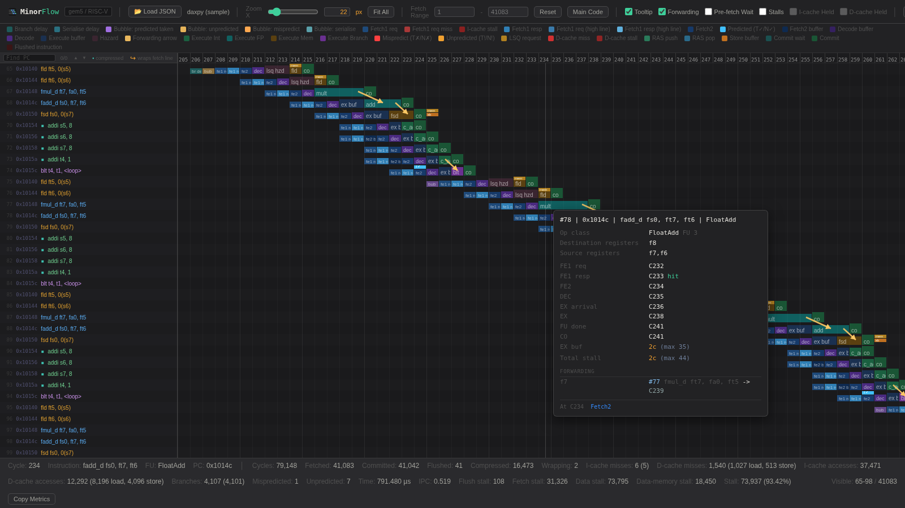

# MinorFlow

A browser-based pipeline visualizer for gem5's MinorCPU. It reconstructs the pipeline cycle by cycle from a gem5 debug trace and draws every instruction as a row, so you can see exactly where cycles are being lost.



## Motivation

gem5 tells you an instruction took a long time. It does not tell you why. The debug trace holds the answer, but a real workload produces hundreds of megabytes of it, and reading that by hand is not viable.

MinorFlow turns that trace into a picture. Each row is an instruction, each cell is a cycle in a stage, and the colour tells you what the core was doing: waiting on an instruction-cache fill, stalled behind a functional unit, held by the scoreboard waiting for an operand, or paying for a mispredicted branch.

## Quick start

Capture a trace from gem5:

```bash
gem5.opt --debug-flags=Minor,MinorTrace,MinorTiming,CacheAll,ExecAll,Fetch,Decode,IEW,Commit,LSQ,Scoreboard,Writeback \
         --debug-file=trace.txt \
         gem5_config_MinorFlow.py <binary>
```

Or let [`run_gem5.py`](#running-a-test-run_gem5py) compile the test, run it with those flags and report the metrics, all in one command:

```bash
python3 run_gem5.py gem5_config_MinorFlow.py daxpy.S
```

Convert the trace to JSON. The driver leaves a copy in `run_results/` next to itself, so that is the shortest path to it:

```bash
python3 MinorFlow_tracer.py run_results/daxpy_trace.txt -o trace.json
```

Then open `MinorFlow.html` in any browser and drag `trace.json` onto the window. There is nothing to install and nothing to serve. The viewer is a single self-contained HTML file with no dependencies.

## Tracer options

```bash
python3 MinorFlow_tracer.py <trace> [-o OUT] [--stats] [--quiet]
```

| Option | Meaning |
| --- | --- |
| `trace` | Path to the gem5 MinorCPU debug trace (`.txt`, `.log`) |
| `-o`, `--out` | Output JSON path. Defaults to `<trace>.json` |
| `--stats` | Print a summary of committed and flushed instructions plus instruction-cache activity |
| `--quiet` | Suppress the progress output |

If the tracer parses zero instructions it will tell you so, which almost always means the trace was captured without the Minor debug flags.

## Running a test: `run_gem5.py`

Capturing a trace by hand means compiling the test against gem5's `m5op.S`, remembering the full debug-flag list, and then reading the numbers out of `stats.txt`. `run_gem5.py` does all of it in one command, and is how every trace in [tests/](tests/) was produced.

Run it **from the gem5 root**: the script takes the current directory as the gem5 root and looks for `./build/RISCV/gem5.opt`, `./include` and `./util/m5/src/abi/riscv/m5op.S` from there.

```bash
python3 run_gem5.py <config>.py <test> [--lang c|asm] [--no-trace]
```

| Argument | Meaning |
| --- | --- |
| `<config>.py` | The gem5 MinorCPU configuration script, for example [gem5_config_MinorFlow.py](gem5_config_MinorFlow.py) |
| `<test>` | The program to run: C (`.c`) or assembly (`.S`, `.s`, `.asm`). The type is detected from the extension |
| `--lang` | Force the type instead of detecting it |
| `--no-trace` | Skip the debug flags and report metrics only. Use it when you only want the numbers, since the trace is the expensive part |
| anything else | Passed on to the configuration script. A configuration that defines its own options gets them this way |

What it does, in order:

1. **Compiles.** `riscv64-unknown-elf-gcc` for `rv64gc` with the bit-manipulation and crypto extensions, freestanding (`-nostdlib -nostartfiles -static -mcmodel=medany`), linking gem5's `m5op.S` so the program can call `m5_reset_stats`, `m5_dump_stats` and `m5_exit`. C tests also get `-fno-builtin -e main`, since there is no crt0 to enter through.
2. **Runs gem5** into `m5out/`, adding the debug flags MinorFlow needs (`Minor`, `MinorTrace`, `MinorTiming`, `CacheAll`, `ExecAll`, `Fetch`, `Decode`, `IEW`, `Commit`, `LSQ`, `Scoreboard`, `Writeback`) and writing `m5out/<test>_trace.txt`. That file is the tracer's input.
3. **Disassembles.** `objdump -d -S -l` into `m5out/<test>.list`, printing it up to the `jal` to `m5_dump_stats`, which is where the measured region ends. The printed part is saved as `m5out/<test>_clean.txt`, under a `DISASSEMBLED CODE` banner and closed by an `END OF DISASSEMBLED CODE` one.
4. **Prints the table**, parsed from the first statistics block in `stats.txt`, the one delimited by the `m5_reset_stats` and `m5_dump_stats` calls: cycles, instructions, I-cache and D-cache misses and accesses, branches, mispredictions plus unpredicted, elapsed microseconds and IPC. The table is appended to `m5out/<test>_clean.txt` below the disassembly, in its own banner, so the two sections can be told apart at a glance. Its title line names the simulator, the program and the L1 geometry the run used, read from gem5's `config.ini`, and the line under it names the configuration file and the flags it was given.
5. **Copies out the keepers.** The trace, the `.list`, the `_clean.txt` and `stats.txt` renamed to `<test>_stats.txt` are copied into a `run_results/` folder next to the script, so a run leaves everything the viewer needs in one place while gem5's own output stays in `m5out/`.

The test is compiled into the gem5 output folder rather than beside the source, so a run touches nothing outside its own folders. `--gem5-out-dir` and `--results-dir` move those folders, which is how the sweep gives concurrent runs one each.

The table has an `OFFICIAL` and a `NET` column. `NET` subtracts a fixed instrumentation overhead.

A configuration script may define options of its own. Any flag `run_gem5.py` does not recognise is handed to it, since gem5 passes everything after the script's path to the script:

```bash
python3 run_gem5.py my_config.py daxpy.S --some-config-flag
python3 run_gem5.py my_config.py daxpy.S -- --some-config-flag   # when it takes a value
```

The `--` form is the unambiguous one: use it for a flag that takes a value, or one whose name collides with `--lang` or `--no-trace`. Forwarded flags are echoed before the run, and if the configuration rejects them its own error comes back through.

### Writing a test

[benchmarks/](benchmarks/) holds the tests used to develop MinorFlow, and `test_template.c` and `test_template.S` are the starting points. The template sets up `gp`, calls `m5_reset_stats`, leaves a `MAIN PROGRAM` / `END OF MAIN PROGRAM` region for your code, and then calls `m5_dump_stats` and `m5_exit`. Write inside the markers and the driver measures and disassembles exactly that region.

## Running the sweep: `run_MinorFlow_sweep.py`

[gem5_config_MinorFlow.py](gem5_config_MinorFlow.py) is not one machine but seventeen. `TEST 1` is the Reference Core. Every other entry perturbs one part of the pipeline so its effect is visible in the viewer, and the comment table names the workload that shows it:

```
#   1   baseline                                        workload: all
#   4   fetch1LineWidth and snap 4 -> 16                workload: icache_pressure
#  11   branchPred LocalBP -> TournamentBP              workload: branch_stress

TEST = 1
```

`run_MinorFlow_sweep.py` replays all of it, which is how the traces in [tests/](tests/) were produced. It always sweeps `gem5_config_MinorFlow.py`, the config it is written for, so it takes no config argument. Run it from the gem5 root, like `run_gem5.py`:

```bash
python3 run_MinorFlow_sweep.py [--configs 1,4-6] [--tests-dir DIR] [--no-trace] [--list]
```

| Option | Meaning |
| --- | --- |
| `--configs` | Which configurations to run, for example `1,4-6`. Defaults to every one in the table |
| `--tests-dir` | Where the workloads live. Defaults to `benchmarks/`, relative to the gem5 root |
| `--tests` | Comma-separated workloads to run for every configuration, instead of the ones the table names |
| `--out-dir` | Where results are collected. Defaults to `MinorFlow_sweep_results/` |
| `--config` | Sweep a copy or a variant of `gem5_config_MinorFlow.py` instead |
| `--no-trace` | Metrics only, no traces |
| `-j`, `--jobs` | How many runs to keep in flight. Defaults to 4. gem5 is single-threaded, so this scales with cores until memory or disk bandwidth binds |
| `--list` | Print the plan and exit, touching nothing |

For each configuration it sets `TEST` and runs that entry's workloads through [`run_gem5.py`](#running-a-test-run_gem5py). An entry whose workload is `all` runs every workload the table names.

Results are moved out of `run_results/` into the out directory as `<test>_trace.config<N>.txt`, `<test>_clean.config<N>.txt`, `<test>_stats.config<N>.txt` and `<test>.config<N>.list`, which is the naming [tests/](tests/) uses, so one configuration never overwrites another and each trace stays paired with the run it came from. Every metrics table is also gathered into one `metrics.txt` in that folder, labelled by configuration and test, so the whole sweep can be read without opening a file per run.

Each run works in its own folder under `m5out/` and `run_results/`, and once collected that folder is deleted. A run that **fails** is the exception: nothing of its is collected or deleted, so its output stays in `m5out/config<N>_<test>/` and is still there at the end. Both parent folders are removed if the sweep leaves them empty, and left alone otherwise, since a plain `run_gem5.py` run writes into them too.

The sweep never edits `gem5_config_MinorFlow.py`: it writes one temporary copy per configuration with `TEST` set, runs those, and deletes them at the end. So an interrupted sweep leaves nothing to restore, and two sweeps can run at once. Use `--list` first: it prints what each configuration would run, names the closest files for any workload that matches nothing, and calls out configurations left with nothing to run.

## Why a separate tracer

The parser used to run in the browser. Large traces do not fit inside the browser's string-size and memory ceilings, so parsing moved to Python, where a trace is processed once, offline. The viewer loads the resulting JSON and does the windowing, the bubble and stall analysis, and the rendering. None of that logic is duplicated between the two.

## What the viewer shows

Per instruction, across its whole lifetime:

- **Fetch1**, request and response, with the request drawn red when the line misses the instruction cache and the fill time charged to the stage that waits for it. Instructions whose bytes span two fetch lines are drawn as two requests, so a line-spanning fetch is visible as such.
- **Fetch2**, where the branch predictor is consulted, with correct predictions and mispredictions distinguished.
- **Decode**, and the forward delay of each pipeline latch when the corresponding delay parameter is greater than one.
- **Execute**, including the wait ahead of a functional unit for the unit itself and for operands held by the scoreboard.
- **Commit wait** and **commit**, so in-order retirement pressure is visible.

Bubbles, front-end stalls, serialisation delays and branch delays each get their own colour and their own entry in the legend, with an explanation attached.

Plus the usual quality-of-life: fit-to-viewport zoom, a hover panel with per-instruction detail, and a PC search box that matches anywhere in the address and steps through hits across the whole fetch window rather than only the rows on screen. Every control has an in-app tooltip, so they are not repeated here.

Keys: `+` and `−` to zoom, arrows to navigate, `Home` and `End` to jump.

## Tested with

- **gem5 v25.0.0.1**, MinorCPU RISC-V model.
- A **ready-to-use Docker image** with gem5 already built, so you can produce traces without compiling anything:

```bash
docker pull manuel313/gem5_v25
```

Image: https://hub.docker.com/repository/docker/manuel313/gem5_v25/general

## Requirements

- Python 3, standard library only
- Any modern browser
- gem5 with the MinorCPU RISC-V model, for producing traces

## Paper

MinorFlow is described in *MinorFlow: A gem5 Pipeline Visualizer for Teaching Computer Architecture*, by Manuel Nieto, Francisco Cortez Casini, María Delfina Vélez Ibarra and Gonzalo Tomás Vodanovic, submitted to **CARLA 2026**, the Latin America High Performance Computing Conference. It motivates the tool from the gap between the textbook five-stage pipeline and what gem5 actually reports, describes the tracer and the viewer, and validates the timeline against gem5's own `stats.txt` on daxpy.

Everything behind the paper lives in [docs/CARLA2026/](docs/CARLA2026/), frozen at the state it was submitted in:

| Path | Contents |
| --- | --- |
| `MinorFlow: A gem5 Pipeline Visualizer for Teaching Computer Architecture.pdf` | The submitted paper |
| `latex/` | LaTeX sources, bibliography and LNCS style files |
| `images/` | Figures: the pipeline and workflow diagrams, the renderer, and the three case studies |
| `gem5_config_Reference_Core.py` | The gem5 configuration of the Reference Core the paper measures |
| `daxpy_validation/` | The daxpy kernel, its trace-derived JSON and the `stats.txt` behind the validation table |
| `MinorFlow.html`, `MinorFlow_tracer.py` | The viewer and tracer as submitted |

The Reference Core is the single-issue in-order 64-bit RISC-V MinorCPU of Table 1 in the paper: 100 MHz, a 16 KiB 4-way L1I and a 32 KiB 8-way L1D at one-cycle hit, a 1024-entry local branch predictor with a 256-entry BTB and a 16-entry RAS. Run it the same way as any other config:

```bash
gem5.opt --debug-flags=Minor,MinorTrace,MinorTiming,CacheAll,ExecAll,Fetch,Decode,IEW,Commit,LSQ,Scoreboard,Writeback \
         --debug-file=trace.txt \
         gem5_config_Reference_Core.py <binary>
```

It is the baseline of the sweep in [gem5_config_MinorFlow.py](gem5_config_MinorFlow.py), flattened into a standalone file: identical parameters, without the test table. Use the sweep instead when you want to perturb one part of the pipeline against this baseline.

If you use MinorFlow in academic work, please cite it. [CITATION.cff](CITATION.cff) carries the metadata for both the software and the paper.

## Related

[CVA6Flow](https://github.com/FaMAF-CVA6-Project/CVA6Flow) is the sibling tool. It visualises the CORE-V CVA6 RISC-V core running under Verilator, reconstructed from raw VCD signal dumps, and is deliberately built to look and behave like MinorFlow so that a simulated pipeline and a real RTL pipeline can be compared side by side.

Both come out of an undergraduate thesis at FaMAF, Universidad Nacional de Córdoba, asking how closely a gem5 MinorCPU configuration can be made to match a real RISC-V core.

## Licence

Released under the MIT Licence. See [LICENSE](LICENSE).
